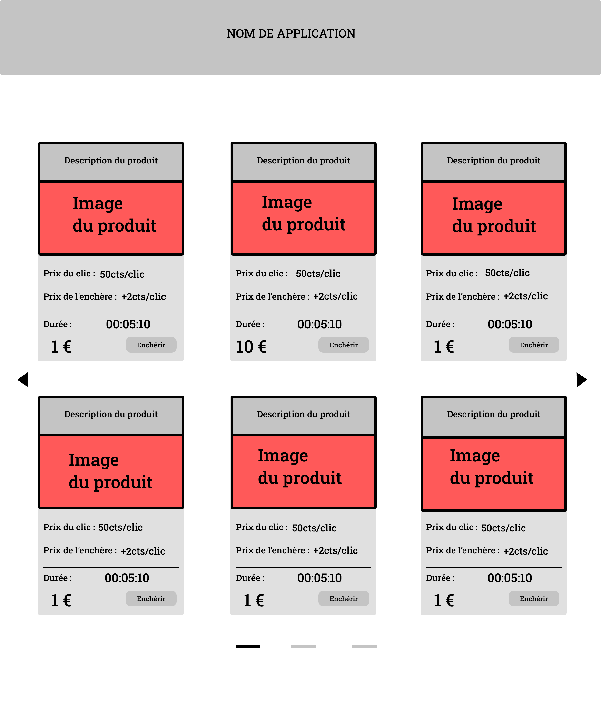
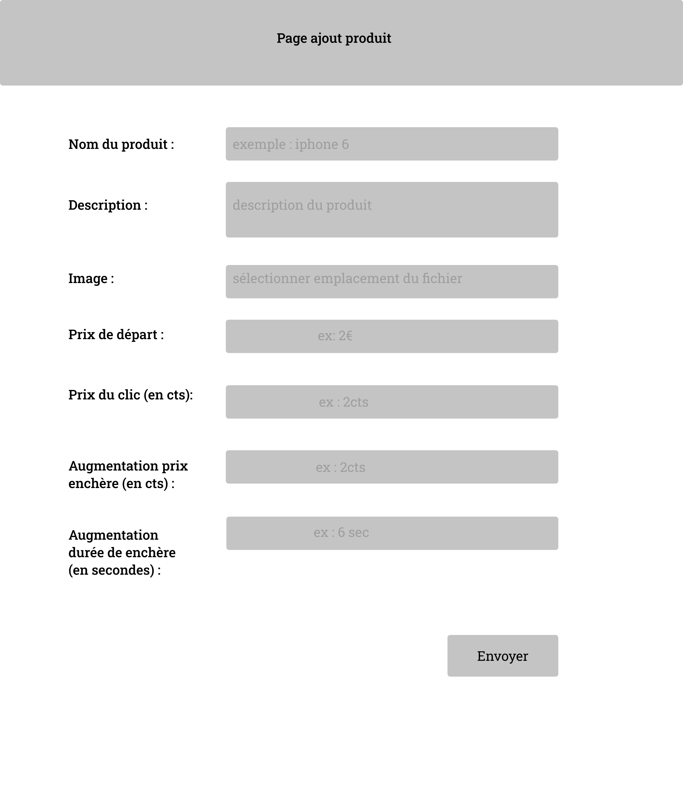
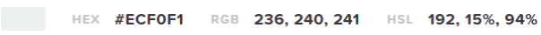
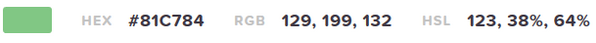

# ****Création d’un proof of concept d’une plateforme d'enchères au centime****

## Concept de l'application web :
Création d'un proof of concept d'une plateforme d'enchères au centime.

## Client :
ToTo Corp.

## User Stories 
| Rôle                      | Quoi?                                                     | Pourquoi?                                         |
| :------------------------ | :-------------------------------------------------------- | :------------------------------------------------ |
| En tant qu’utilisateur    | Consulter le produit dont l'enchère est en cours          | Savoir si le produit est toujours disponible      |
| En tant qu’utilisateur    | Connaître le temps restant de l’enchère                   | Savoir le temps restant pour renchérir            |
| En tant qu’utilisateur    | Connaître le prix actuel                                  | Savoir le prix du produit lors de la consultation |
| En tant qu’utilisateur    | Pouvoir naviguer de façon simple sur l'application        | Faciliter l'utilisation pour l'utilisateur        |
| En tant qu’utilisateur    | Identifier l'application au premier regard                | Reconnaitre l'application du premier regard       |
| En tant qu’utilisateur    | Connaître le coût du clic                                 | Savoir le tarif du clic                           |
| En tant qu’utilisateur    | Connaître de combien le temps de l'enchère augmente       | Savoir que le clic augmente la durée              |
| En tant qu'administrateur | Initialiser le prix de départ                             | Choisir le prix de départ du produit              |
| En tant qu'administrateur | Définir les modalités des enchères                      | Définir de combien le prix et le temps de l'enchère va augmenter |

## Wireframe

## Palettes de couleurs retenues par le client :

* Orange : #FF9800
  * Plus agressif, l’orange est parfait pour les « call to action » et provoque l’envie d’acheter ou de s’abonner. 
  * Fanta, qui vise un public jeune dans son marketing, propose un orange vif qui capte l’attention d’un public très demandé et provoque un sentiment de confiance lors de l’achat.

* Blanc : #ECF0F1
  * Assimilé à la pureté, à la paix et qu'il est le symbole de la sagesse, l'innocence, la pureté et le Divin.

* Vert :  #81C784
  * Très utilisé pour promouvoir des produits
  * Stimulant de concentration
  * Attire l'attention (exemple le feu vert d'un feu de circulation et donne le GO)
  * Couleur de l'espoir, méditation, inspiration

* Typographie :  ROBOTO

https://fonts.googleapis.com/css2?family=Roboto:wght@100&display=swap

* Pictos : Font Awesome

https://fontawesome.com/