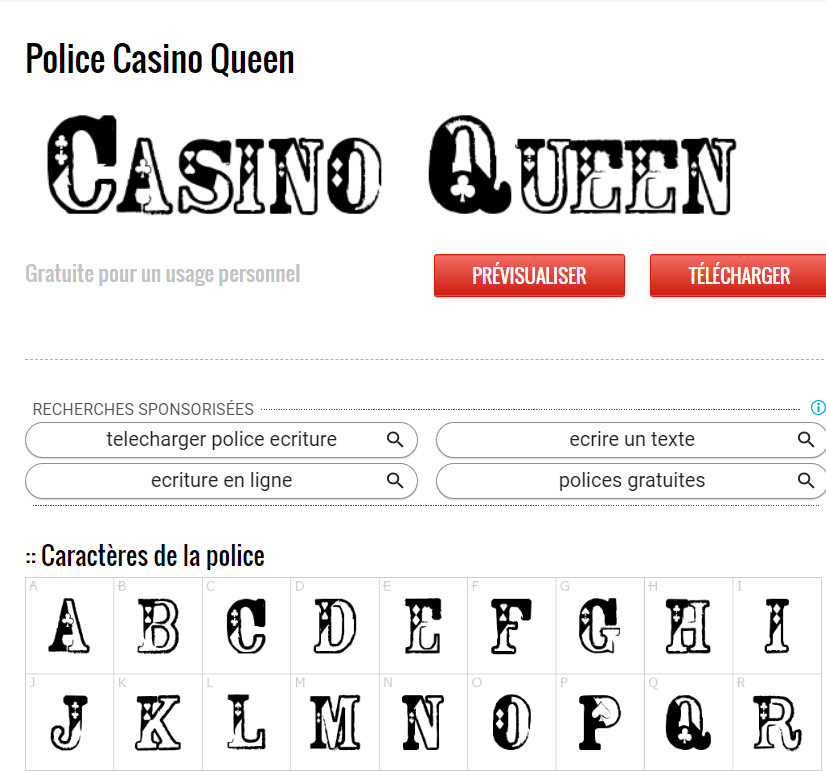
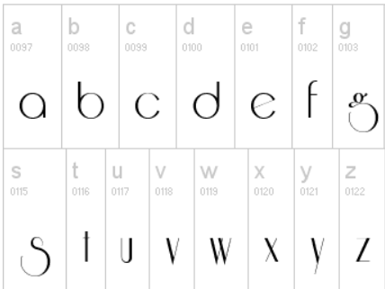
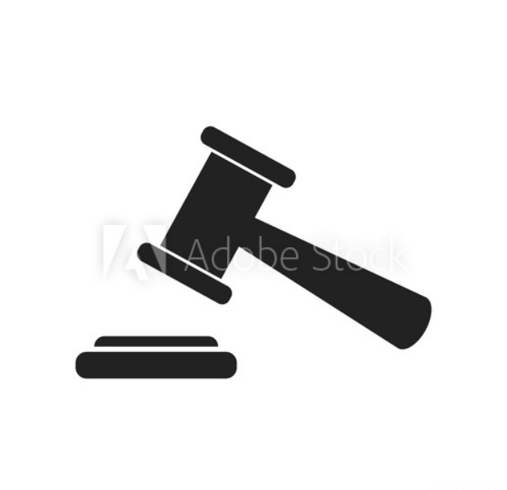

**thème 1**

Ce premier thème s’inspire de l’univers du jeu (casino), nous partons de l’idée que le client en faisant cette acte de sur enchère ai l’impression de jouer à obtenir l’objet désiré au meilleur prix.

Déclinaison typographique:

**TITRE**
**1er** **proposition** **(Police Casino queen)** 

**2eme proposition (Riesling)**

  **TEXTE**
 
 **1er** **proposition** **(Police Casino queen)** 

**2eme proposition** **(Police Casino queen)** 

   

Déclinaison couleur:

   ****LE ROUGE****

  

Le rouge est un choix de couleurs audacieux associé à l’excitation, la passion, le danger, le frisson, l’énergie et l’action. Vous remarquerez peut-être que certaines marques utilisent du rouge pour leurs boutons «appel à l’action» («commandez maintenant», «achetez maintenant», etc.).En effet, le rouge est une couleur intense qui peut provoquer de fortes émotions qui peuvent vous inciter à acheter des choses
**Background**

  
   
  
-   Audace
    
-   En quête de sensations fortes
    
-   Appel à l’action
    
-   Apprécie l’aventure
    
-   Impulsivité

 ****LE VERT****

Deux des choses qui font tourner le monde sont associées au vert : la nature et… l’argent (le dollar est vert). Le vert peut signifier la croissance, la fertilité, la santé, la richesse, le bien-être ou la générosité.

 (Error)

COLOR: ##1F5F27

Cette couleur est associée a :

-   L’abondance
    
-   Génorisité
    
-   L’argent

Logo & icons: 

 (Error)

 (Error)

